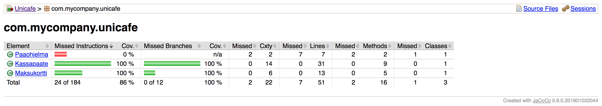

# OTM-harjoitustyö

Kielenä käytössä *JavaScript*

## Dokumentaatio

[Vaatimusmäärittely](dokumentaatio/vaatimusmaarittely.md)

[Työaikakirjanpito](dokumentaatio/tyoaika.md)

## Tehtävät

**viikko2**

**viikko1**

[komentorivi.txt](laskarit/viikko1/komentorivi.txt)

[gitlog.txt](laskarit/viikko1/gitlog.txt)
