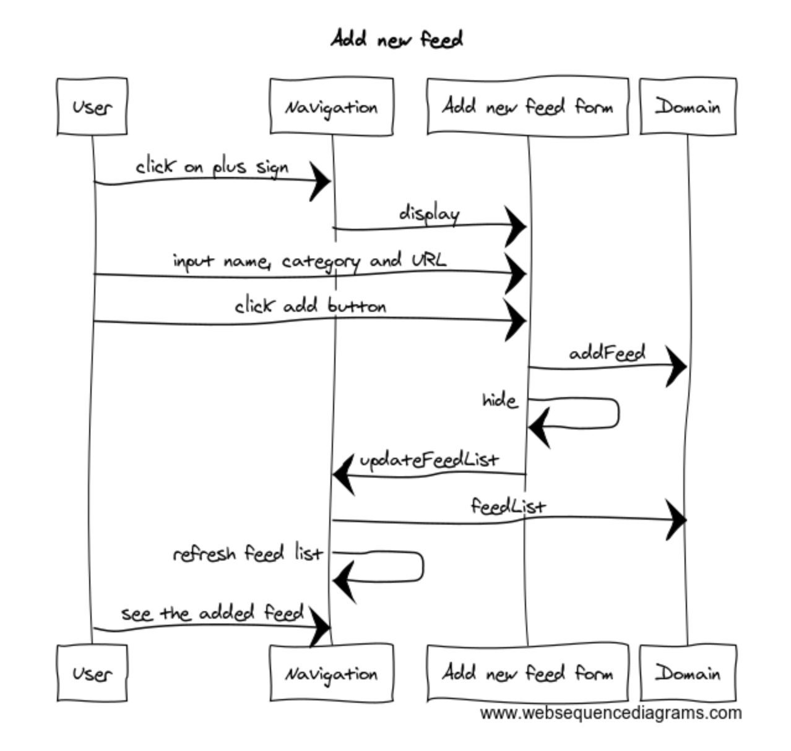

# Arkkitehtuurikuvaus

## Sovelluslogiikka

Sovelluksen korkean tason logiikka löytyy domain/FeedReaderistä.

Sovellus tallentaa pysyvän tiedon sovelluksen käyttäjäkohtaiseen hakemistoon käytetyn käyttöjärjestelmän mukaisesti.

Tietokantana on käytössä NeDB. Tietokannan abstraktiona on domain/datastore.

## Päätoiminnallisuudet

Kuvataan seuraavaksi sovelluksen toimintalogiikka päätoiminnallisuuden osalta sekvenssikaaviona.

### feedin lisäys

