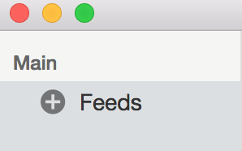

# Käyttöohje

## Ohjelman käynnistäminen

Ohjelma käynnistetään komennolla 

```
npm start
```

## Feedin lisäys

Paina + nappia avataksesi feedin lisäys lomakkeen:




Täytä feedin tiedot ja paina "Add" nappia:


Uusi feedi on ilmestynyt navigaatioon.
