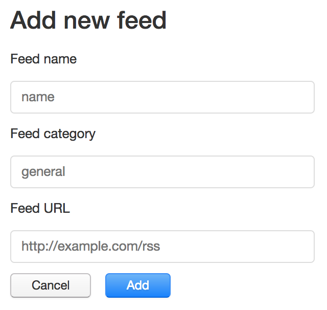

# Käyttöohje

## Ohjelman lataaminen

Lataa käyttöjärjestelmällesi kohdistuva paketti täältä: https://github.com/pihvi/otm-harjoitustyo/releases/tag/final

Pura paketti ja käynnistä sieltä tullut FeedReader ohjelma.

## Feedin lisäys

Paina + nappia avataksesi feedin lisäys lomakkeen:

Täytä feedin tiedot ja paina "Add" nappia:

Uusi feedi on ilmestynyt navigaatioon.

Klikkaa lisäämäsi feedin nimeä nähdäksesi sen listauksen.

Klikkaa listauksessa otsikkoa nähdäksesi koko sisällön.

Testaa esimerkiksi feedillä: https://boingboing.net/feed

Feedin nimen vasemmalla puolella olevasta roskakorista saa poistettua feedin.

Feedin nimen oikealla puolella näkee lukemattomien artikkelien määrä feedissä.
Saat merkattua kaikki luetuksi, kun kyseinen feedi on aktiivinen ja numeroa klikkaa.
Kun feedin artikkelin avaa luettavaksi, se merkkautuu automaattisesti luetuksi ja muuttuu harmaaksi listauksessa.
