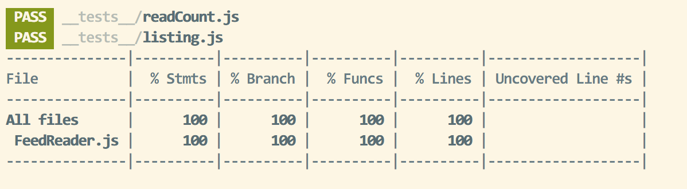

# Testausdokumentti

Ohjelmaa on testattu sekä automatisoiduin testein että manuaalisesti tapahtunein järjestelmätason testein.

## Automaattiset testit

Testaus tapahtuu FeedReader.js:n kautta eli ohjelman päälogiikan kautta. Testit ovat \_\_tests\_\_ hakemistossa.
Tietokanta on abstrahoitu datastoren kautta ja testeissä datastore on mockattu, mutta mockin
toiminnallisuus vastaa kuitenkin oikeaa tietokantaa.

### Testauskattavuus

Käyttöliittymäkerrosta lukuunottamatta sovelluksen testauksen rivi- ja haarautumakattavuus on 100%

## Järjestelmätestaus

Sovelluksen järjestelmätestaus on suoritettu manuaalisesti.

## Sovellukseen jääneet laatuongelmat

Sovellus ei anna tällä hetkellä järkeviä virheilmoituksia, seuraavissa tilanteissa
- syötetään virheellinen feedin osoite
- toiminnallisuus ilman nettiä tai jos feedin kohdeyhteys jumittaa tai on hidas
