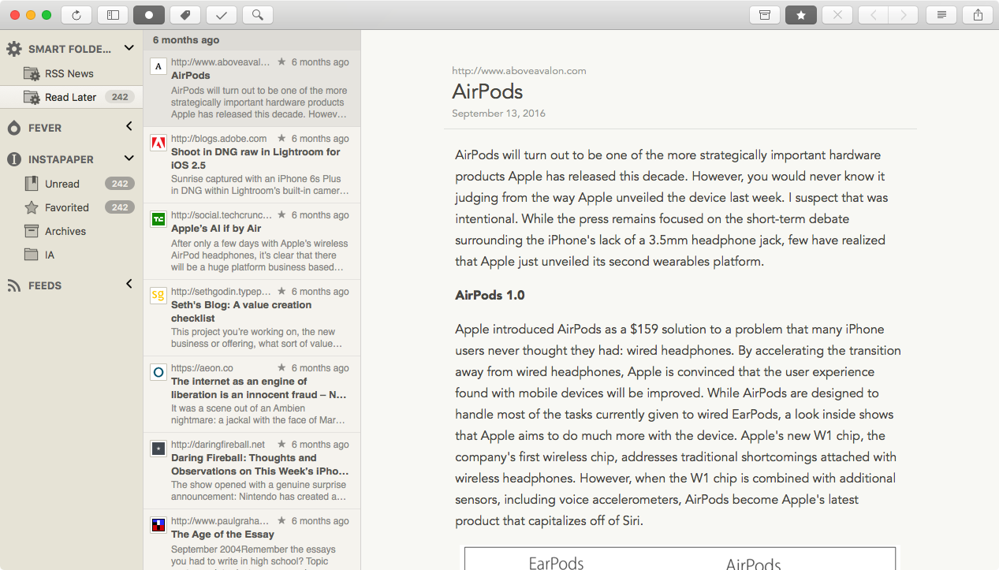

# Vaatimusmäärittely

## Sovelluksen tarkoitus

Sovelluksen tarkoitus on tehdä helposti luettavaksi RSS feed muotoisista lähteistä tuleva informaatio.

## Käyttäjät

Alkuvaiheessa sovelluksella on ainoastaan yksi käyttäjä. Myöhemmin on tarkoitus lisätä kirjautuminen, jolloin samaa sovellusta voi käyttää monta käyttäjää, joilla kaikilla on yksi ja sama rooli.

## Käyttöliittymäluonnos

Sovellus koostuu yhdestä näkymästä, missä on kolme saraketta.

(lähde ja lisää hyviä malleja https://zapier.com/blog/best-rss-feed-reader-apps/)

Vasemmassa sarakkeessa on RSS feedien lähteet. Keskellä on yhden feedin artikkelit listana. Oikeassa on yksi artikkeli kokonaisuudessaan.

## Perusversion tarjoama toiminnallisuus

### Kun feedejä ei ole yhtään

- käyttäjälle näytetään ohje, kuinka lisätään uusi feedi

- käyttäjälle tarjotaan muutama suosittu feedivaihtoehto

### Kun feedejä on lisätty

- käyttäjä näkee avatessa feedin sen uusien artikkelien määrät

- käyttäjän artikkeli merkkautuu luetuksi, kun se avataan

- käyttäjä voi merkata yksittäisen feedin luetuksi

- feedien ryhmittely kategorioihin

- feedi voidaan poistaa

## Jatkokehitysideoita

Perusversion jälkeen järjestelmää täydennetään ajan salliessa esim. seuraavilla toiminnallisuuksilla

- rekisteröityminen ja tilan tallentaminen pilveen, jolloin sama käyttäja voi käyttää useaa tietokonetta
- jakaminen artikkeleihin, some, email, jne.
